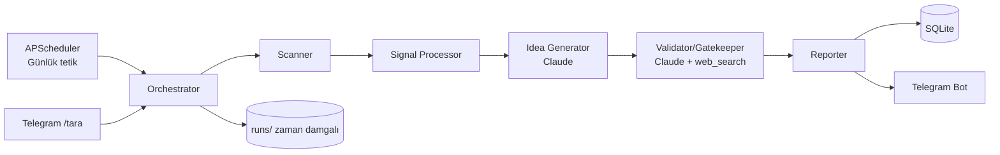

# ARCHITECTURE.md

> Son güncelleme: 2026-06-13

## Genel Bakış
Tek konteyner içinde çalışan, zamanlanmış bir pipeline ve bir Telegram botundan
oluşan çok ajanlı sistem. Ajanlar tek sorumluluk taşır ve birbirleriyle
yapılandırılmış veri (dataclass/JSON) ile konuşur.

## Pipeline Diyagramı

## Veri Akışı
1. **Scanner** kaynaklardan ham sinyal toplar → `signals`.
2. **Signal Processor** kümeler/skorlar → `clusters`.
3. **Idea Generator** skorlu sinyallerden fikir üretir → `ideas` (status=candidate).
4. **Validator** 5 testi uygular, web_search ile rakipleri doğrular, skorlar →
   `ideas` (status=passed|rejected).
5. **Reporter** geçen fikirlerden Türkçe rapor üretir → `reports`, dosya + Telegram özeti.
6. **Telegram Bot** raporu yollar, komutları ve serbest sohbeti işler.

## Bileşen Sorumlulukları
| Bileşen | Sorumluluk | Dosya |
|---|---|---|
| Orchestrator | Sıralama, retry/backoff, run kaydı | `orchestrator.py` |
| Scanner | Kaynak fetcher'ları + graceful skip | `agents/scanner.py`, `agents/sources/*` |
| Signal Processor | Kümeleme, gürültü ayıklama, skor | `agents/signal_processor.py` |
| Idea Generator | Şablonlu LLM fikir üretimi | `agents/idea_generator.py` |
| Validator | Gerçeklik Kuralı 5 testi + skor | `agents/validator.py` |
| Reporter | Markdown + Telegram özeti + karşılaştırma | `agents/reporter.py` |
| Telegram Bot | Komut/serbest sohbet, oturum bağlamı | `telegram/bot.py`, `telegram/handlers.py` |
| LLM wrapper | Anthropic client, web_search, token sayacı | `llm.py` |
| Config | pydantic-settings, .env | `config.py` |
| DB | SQLite şema + repository | `db.py`, `models.py` |

## Veri Modeli (SQLite)
- `signals(id, source, url, title, summary, published_at, metric, fetched_at, run_id)`
- `clusters(id, run_id, label, score, signal_ids_json)`
- `ideas(id, run_id, title, signal_refs_json, target_customer, pain, revenue_model,
  first_revenue_estimate, mvp_scope, dev_time, competitors_json, main_risk,
  confidence, validation_notes, status)`
- `reports(id, run_id, date, markdown_path, telegram_summary, scanned_sources_json)`
- `runs(id, started_at, finished_at, status, token_usage, cost_estimate, error)`
- `sessions(chat_id, context_json, updated_at)`

## Yetkilendirme Modeli
Telegram botu yalnızca `.env`'deki `TELEGRAM_CHAT_ID` (ve gelecekte izinli id
listesi) ile konuşur; yetkisiz chat_id istekleri reddedilir.

## Hata Yönetimi & Loglama
- Tüm dış çağrılar timeout + retry/backoff ile sarılır.
- Bir kaynak başarısız olursa pipeline durmaz; "kaynak X başarısız" loglanır ve
  raporun "Taranan kaynaklar" bölümünde işaretlenir (graceful degrade).
- stdlib `logging`, JSON formatter; her run için LLM token/maliyet özeti loglanır.

## Ölçeklenebilirlik Planı
Başlangıç: tek konteyner + SQLite. Büyürse: Postgres'e geçiş, kaynak fetcher'ların
paralel/asenkron çalıştırılması, çoklu kullanıcı oturum tablosu.

## Klasör/Dosya Yapısı
`CLAUDE.md` "Dosya Yapısı" bölümüne bakınız; bu doküman bileşen düzeyini detaylandırır.
